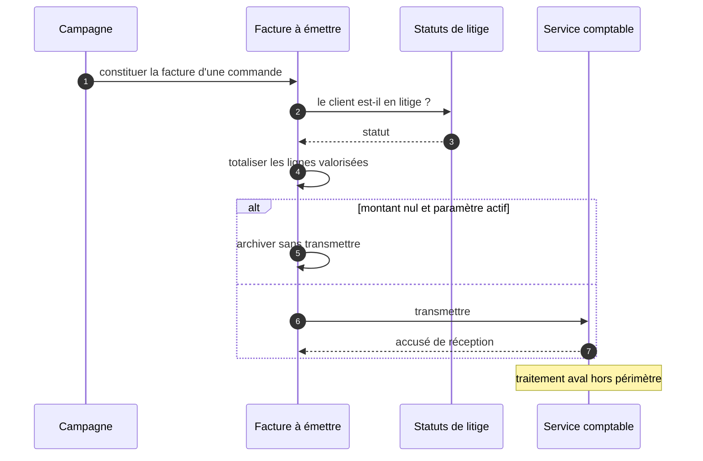

> **Question :** avec qui la constitution d'une facture dialogue-t-elle, et dans quel ordre ?
> **Confiance : C — corroboré** · une frontière non franchie en aval

<!-- diagram: DIA-SFD-003 · N=4 E=7 McCabe=3 -->

