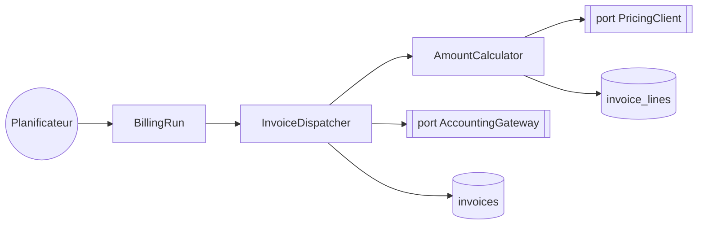

> **Question :** quels composants ce batch mobilise-t-il, et lesquels franchissent une frontière ?
> **Confiance : C — corroboré** · deux dispatchs non résolus, cf. § 14

<!-- diagram: DIA-STD-001 · N=8 E=7 McCabe=1 -->

