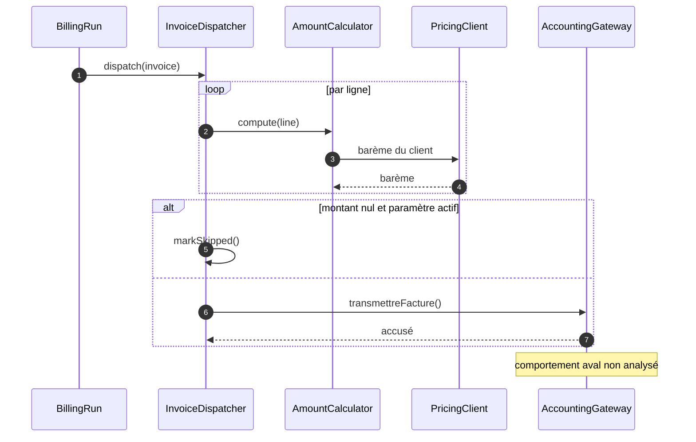

> **Question :** dans quel ordre les composants s'appellent-ils pour une facture, et où sort-on du périmètre ?
> **Confiance : C — corroboré** · une frontière non franchie en aval

<!-- diagram: DIA-STD-002 · N=5 E=7 McCabe=4 -->

