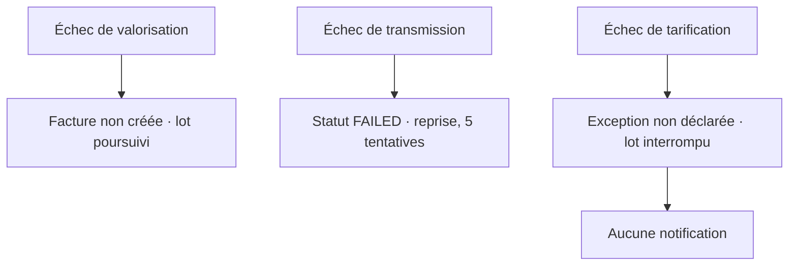

> **Question :** que devient une facture selon l'endroit où l'exécution échoue, et que le support observe-t-il ?
> **Confiance : C — corroboré** · aucune trace d'exécution pour confirmer les fréquences

<!-- diagram: DIA-STD-003 · N=7 E=4 McCabe=1 -->

