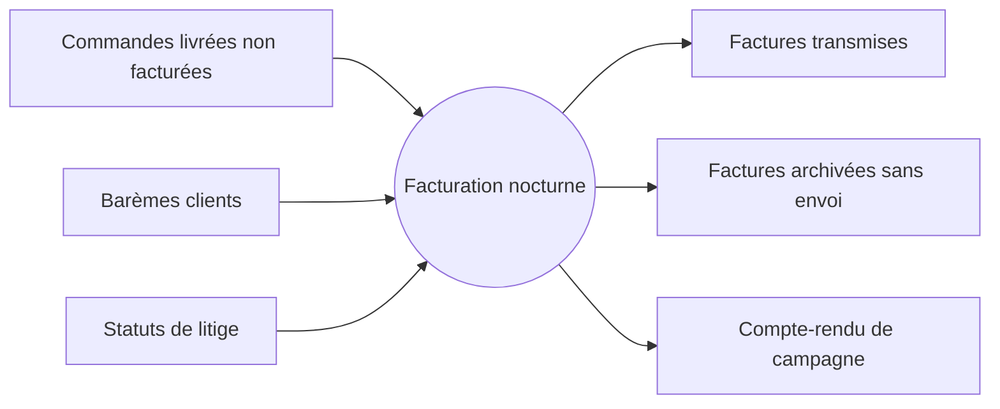
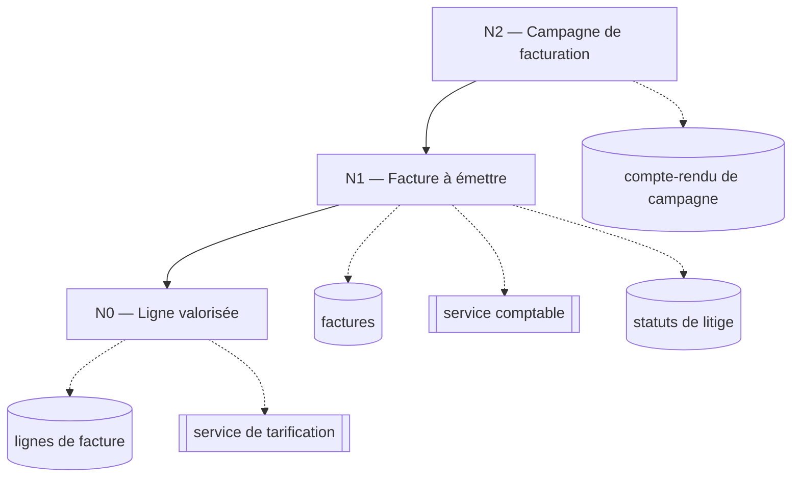
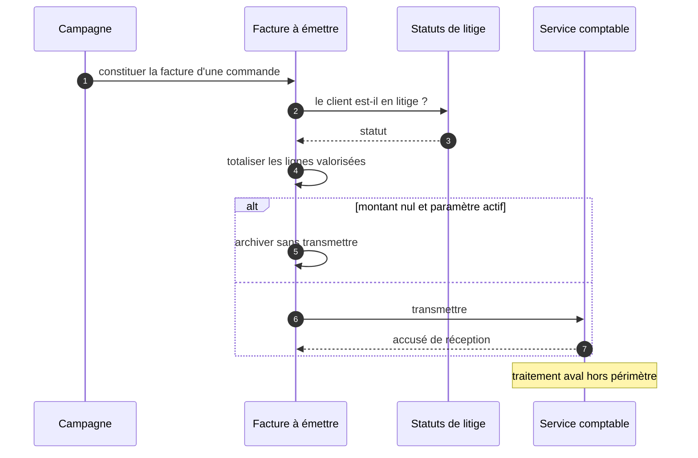

# FACTURATION — Spécification Fonctionnelle Détaillée

> **Audience.** Hybride MOA/MOE. La SFD décrit le processus métier et le comportement observable ; la STD associée renseigne le **comment** technique de chacun.
>
> **Périmètre.** Le processus de facturation nocturne et sa refacturation manuelle.
>
> **Interdits.** Aucun bloc de code, aucun nom de classe, aucun nom de patron de conception. Le patron a servi au découpage ; il n'a rien à faire ici.

## 1. Processus métier

### 1.2 Le problème que ce traitement résout

Ce document décrit **ce que le processus fait et avec quelles données**, en nominal et en erreur, ainsi que les sources et les puits qu'il mobilise. Il se lit par niveaux d'abstraction décroissants : le processus entier d'abord, ses composants ensuite.

Trois niveaux suffisent ici. Un quatrième aurait été un empilement inutile ; deux auraient produit un diagramme au-delà du seuil de lisibilité.

## 2. Processus général du système d'information

> **Question :** qu'entre-t-il et que sort-il de la facturation nocturne, vue de l'extérieur ?
> **Confiance : C — corroboré**

<!-- diagram: DIA-SFD-001 · N=7 E=6 McCabe=1 -->

### 2.3 Étapes de transformation du traitement

> **Question :** comment le processus se décompose-t-il, et jusqu'où ?
> **Confiance : I — inféré** · regroupements proposés par l'analyse, validés au gate de découpage

<!-- diagram: DIA-SFD-002 · N=9 E=8 McCabe=1 -->

## 3. Processus détaillé du système d'information

### 3.1 N2 — Campagne de facturation

Ancré dans [`STD-facturation.md`](../socle/capacites/facturation.md) § 3 et § 4.

### 3.2 N1 — Facture à émettre

Ancré dans [`STD-facturation.md`](../socle/capacites/facturation.md) § 5 et § 9.

> **Question :** avec qui la constitution d'une facture dialogue-t-elle, et dans quel ordre ?
> **Confiance : C — corroboré** · une frontière non franchie en aval

<!-- diagram: DIA-SFD-003 · N=4 E=7 McCabe=3 -->

### 3.3 N0 — Ligne valorisée

Ancré dans [`STD-facturation.md`](../socle/capacites/facturation.md) § 4 et § 7.

### 3.4 Synthèse des niveaux

| Business object | Feuilles propres | Sous-objets | Profondeur | Couche métier |
|---|---|---|---|---|
| Campagne de facturation | compte-rendu de campagne | Facture à émettre | 2 | orchestration |
| Facture à émettre | factures · service comptable · statuts de litige *(ad-hoc, en boucle)* | Ligne valorisée | 1 | préparation |
| Ligne valorisée | lignes de facture · service de tarification *(ad-hoc, en boucle)* | — | 0 | calcul |

## 4. Services externes sollicités

| Service | Sollicité par | Cardinalité | Contrat |
|---|---|---|---|
| Service comptable | N1 — Facture à émettre | une fois par facture transmise | résolu |
| Service de tarification | N0 — Ligne valorisée | **une fois par ligne**, jusqu'à quarante par facture | **non résolu** |

Le second n'a pas de contrat établi : le jour où il tombe, personne ne saura qui appeler.

## 5. Gestion des erreurs

| Erreur | Site de levée | Effet observable |
|---|---|---|
| Valorisation impossible | une ligne | facture non créée, campagne poursuivie |
| Transmission refusée | une facture | reprise à la campagne suivante, **cinq fois au maximum** |
| Tarification indisponible | **une ligne** | **la campagne entière s'arrête**, sans notification |

> **Le site de levée et l'effet observable ne sont pas le même fait.** La troisième ligne le montre : l'erreur naît sur une ligne et se voit sur tout le lot. Les confondre produirait deux affirmations contradictoires — et une contradiction laissée ici devient une promesse fausse en SFG.

## 6. Cas de test

**Sans objet dans ce processus.** Les cas de test de ce processus sont décrits dans la STD, § 8, parce qu'ils portent sur des états techniques — statut de facture, appel au port comptable — que la SFD ne nomme pas.

Une section imposée ne se supprime pas : un résultat négatif explicite fait gagner du temps au lecteur, une section absente lui laisse croire à un oubli et le pousse à chercher lui-même.

## 7. Règles de gestion

| Règle | Énoncé | Niveau |
|---|---|---|
| `BR-FACT-021` | le montant de chaque ligne est calculé au dix-millième, arrondi au demi-supérieur, alors que l'affichage en montre deux décimales | **V** |
| `BR-FACT-014` | une facture à montant nul n'est pas transmise **lorsque le paramètre d'exclusion est actif** — il l'est en production, pas par défaut dans le dépôt | **I** |

### 7.2 À confirmer par le métier

1. **Factures à montant nul** — règle comptable voulue, ou reliquat de l'incident d'import de 2019 ? → `BR-FACT-014` · `OQ-012`
2. **Refacturation manuelle** — doit-elle appliquer les mêmes règles ? Elle contourne aujourd'hui la garde. → `OQ-019`
3. **Précision à quatre décimales** — choix métier lié aux contrats au pourcentage, ou héritage ? → `BR-FACT-021` · `OQ-013`
4. **Clients en litige** — le report est-il indéfini ? Aucune limite trouvée. → `OQ-022`
5. **Service de tarification** — quel contrat, quelle supervision ? → `OQ-024`

## 8. Références

| Document | Lien |
|---|---|
| STD dont cette SFD est l'abstraction | [STD Facturation](../socle/capacites/facturation.md) |
| SFG qui en dérive | [SFG Facturation](../socle/capacites/facturation.md) |

## 9. Historique

| Version | Date | Nature |
|---|---|---|
| 1.0 | 2026-09-08 | Rédaction depuis la STD figée |
| 1.1 | 2026-09-08 | **Correction en revue.** Le business object « Ligne valorisée » s'appelait « Ligne de facture ». Le métier a corrigé : une ligne de facture est le résultat, la valorisation est l'opération — et c'est elle qui porte la règle d'arrondi. |

## 10. Annexes

Ce chapitre porte **2 légendes** de notation, pour les **3 diagrammes** du document, puis les limites de l'analyse.

Une légende sans diagramme qui l'emploie se retire ; une notation employée sans sa légende laisse le lecteur interpréter un dessin. Les deux sont contrôlés.

### 10.1 Ce qui n'a pas été analysé

- Le traitement en aval du service comptable, hors périmètre.
- Le module de relance, rattaché à la capacité *Recouvrement*.
- Deux points d'appel dynamiques du socle technique, non résolus — ils masquent potentiellement des traitements supplémentaires (`OQ-017`).

### 10.2 Légende — diagramme d'activité

Ces diagrammes se lisent de gauche à droite ou de haut en bas, chaque nœud étant une opération ou une donnée, chaque flèche un enchaînement.

| Forme | Ce qu'elle désigne |
|---|---|
| rectangle | une opération du processus |
| cylindre | une donnée persistée — table, fichier |
| double rectangle | une frontière du système — service externe, port |
| cercle | un point de départ ou d'arrivée |
| flèche pointillée | une lecture ou une écriture, par opposition à un enchaînement |

### 10.3 Légende — diagramme de séquence

Ces diagrammes montrent **qui parle à qui, et dans quel ordre**. Le temps descend.

| Élément | Ce qu'il désigne |
|---|---|
| colonne | un participant : composant du périmètre, ou acteur externe |
| flèche pleine | un appel |
| flèche pointillée | une réponse |
| bloc `alt` | une alternative — une seule branche s'exécute |
| bloc `loop` | une répétition, dont la cardinalité est dite en note |
| note | une frontière non franchie par l'analyse |
