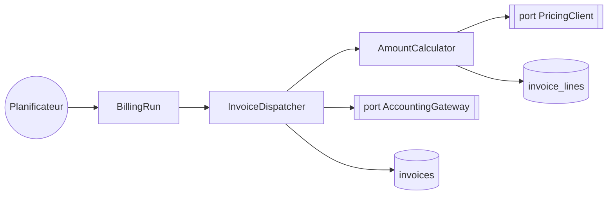
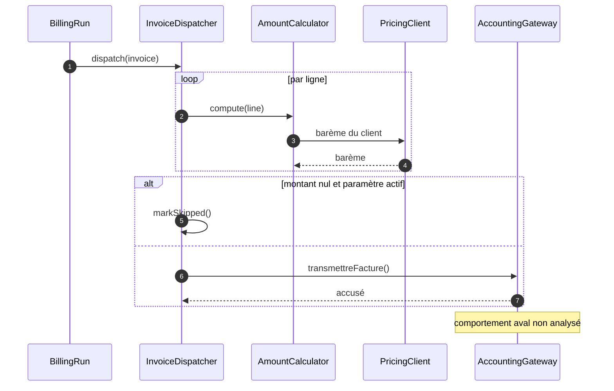
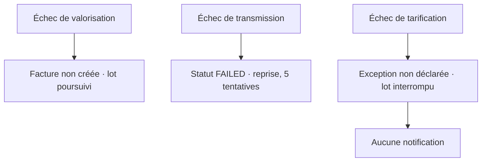

# FACTURATION — Spécification Technique Détaillée

> **Audience.** Purement MOE — développeur, architecte, opérateur qui doit intervenir sur la solution. Elle expose ce que la SFD retient hors de son périmètre : noms de classes, patrons nommés, attributs transactionnels, tables, dépendances.
>
> **Périmètre.** Processus de facturation — un job planifié et une route de refacturation manuelle. Le § 1 les catalogue.
>
> **Aucun bloc de code** : la STD porte des références — `fichier:lignes`, signatures, noms de tables (D16).

## 1. Cartographie des composants

Le batch est câblé en trois couches : un déclencheur planifié, un service d'orchestration, et deux ports sortants.

> **Question :** quels composants ce batch mobilise-t-il, et lesquels franchissent une frontière ?
> **Confiance : C — corroboré** · deux dispatchs non résolus, cf. § 7

<!-- diagram: DIA-STD-001 · N=8 E=7 McCabe=1 -->

`BillingRun` orchestre, `InvoiceDispatcher` décide et transmet, `AmountCalculator` valorise. Les deux ports sont les seules sorties du périmètre.

### 1.5 Cohésion et couplage des composants

| Composant / relation | Degré | Fait qui le prouve |
|---|---|---|
| `AmountCalculator` | cohésion **de fonction** ✔ | une seule responsabilité, valoriser une ligne ; prouvée par test de caractérisation (§ 15) |
| `InvoiceDispatcher` | cohésion **séquentielle** ✔ | garde, transmission, marquage d'état s'enchaînent sur le même objet (§ 5) |
| `BillingRun` | cohésion **procédurale** ~ | sélection, boucle et journalisation de campagne partagent l'ordre, pas l'objet |
| `ReinvoiceCommand` → `AccountingGateway` | couplage **de contenu** ✘ | court-circuite `InvoiceDispatcher` et ses gardes (point d'attention 3) |
| `reporting` → table `invoices` | couplage **commun** ✘ | lecture directe de la table sans passer par le module (point d'attention 4) |

Les deux `✘` sont des dettes documentées, pas des découvertes de cette table : elles renvoient à des faits établis ailleurs dans ce document.

## 2. Modèle de données

**Tables lues** — `orders`, `order_lines`, `customers` (colonne `dispute_status`), `pricing_scales`
**Tables écrites** — `invoices`, `invoice_lines`, `billing_runs`

Colonnes déterminantes : `invoice_lines.amount` en `DECIMAL(12,4)`, `invoices.status` en énumération à quatre valeurs, `customers.dispute_status`.

### 2.5 Requêtes clés

| Référence | Tables | Colonnes | Intention |
|---|---|---|---|
| `OrderRepository.java:88` | `orders`, `order_lines` | `delivered_at`, `invoiced_at` | sélection des commandes livrées non facturées |
| `CustomerRepository.java:41` | `customers` | `dispute_status` | exclusion des clients en litige — **appelée par commande, pas en lot** |

**Les requêtes de `ReportingRepository` sur `invoices` relèvent du module `reporting`, hors périmètre — ne pas les attribuer à ce batch.** C'est le piège d'attribution le plus probable ici : elles portent sur les mêmes tables.

## 3. Traitement de données

### 3.1 Configuration

| Propriété | Valeur |
|---|---|
| Nom du job | `nightly-billing` |
| Déclenchement | cron `0 2 * * *` |
| Taille de lot | 200 factures |
| Politique de rejet | `skip-limit` 10, puis échec de la campagne |
| Point d'entrée | `BillingRun.execute()` |
| Contrats couverts | `ACC_INV_TRANSMIT_001` · un contrat non résolu (§ 9) |
| Paramètre déterminant | `billing.skipZeroAmount` — **défaut du dépôt `false`, production `true`** |

### 3.2 Architecture du flux

Trois étapes séquentielles : sélection des commandes éligibles, traitement par lot, clôture de campagne. Une seule branche conditionnelle, sur le montant nul, décrite en § 5.

### 3.3 Détail par étape

**Sélection** — `BillingRun.selectEligible()` `src/billing/BillingRun.java:52-78`. Retient les commandes livrées, non facturées, dont le client n'est pas en litige. Le statut de litige est lu **par commande**, pas en lot : voir le point d'attention 5.

**Traitement** — `InvoiceDispatcher.dispatch(Invoice)` `src/billing/InvoiceDispatcher.java:180-280`. Valorise, applique la garde, transmet, marque l'état.

**Clôture** — `BillingRun.close()` `src/billing/BillingRun.java:98-120`. Écrit le compte-rendu de campagne dans `billing_runs`.

### 3.4 Traitement unitaire

Par facture : valorisation des lignes, puis garde sur le montant nul, puis transmission.

La garde est en `src/billing/InvoiceDispatcher.java:212`. Elle n'est active que si `billing.skipZeroAmount` vaut `true` — **ce qui est le cas en production et en recette, mais pas dans la configuration par défaut du dépôt**.

Chaque facture est traitée dans sa propre transaction : l'échec de l'une n'annule pas le lot.

### 3.5 Séquence technique

> **Question :** dans quel ordre les composants s'appellent-ils pour une facture, et où sort-on du périmètre ?
> **Confiance : C — corroboré** · une frontière non franchie en aval

<!-- diagram: DIA-STD-002 · N=5 E=7 McCabe=4 -->

### 3.6 Mapping et transformations

Aucun mapper généré dans ce chemin. Les transformations sont manuelles dans `InvoiceAssembler.java:33-70`. Le seul mapper du module concerne l'export CSV, hors de ce point d'entrée.

## 4. Gestion des erreurs

> **Question :** que devient une facture selon l'endroit où l'exécution échoue, et que le support observe-t-il ?
> **Confiance : C — corroboré** · aucune trace d'exécution pour confirmer les fréquences

<!-- diagram: DIA-STD-003 · N=7 E=4 McCabe=1 -->

**Site de levée et effet observable sont distincts, et il faut les lire séparément.** Un échec de tarification est levé sur **une ligne** ; son effet observable est l'interruption de **tout le lot**, parce que l'exception n'est pas déclarée et remonte jusqu'au gestionnaire de campagne. Les confondre produirait deux affirmations contradictoires dans la SFD.

Exceptions **non déclarées** : `PricingUnavailableException` remonte sans être capturée — c'est le chemin qui interrompt le lot.
**Chemin inatteignable** : la branche `skipZeroAmount = false` n'est couverte par aucun test.

## 5. Appels externes

| Code | Barreau | Artefact:version | Interface | Méthode | Contexte | Comportement d'échec |
|---|---|---|---|---|---|---|
| `ACC_INV_TRANSMIT_001` | 1 | `acme/atlas/accounting-api:4.7.2` | `AccountingGateway` | `POST /invoices/transmit` | une fois par facture transmise | statut `FAILED`, reprise à la campagne suivante, **cinq tentatives au maximum** |
| `SIM_XXX_XXX_XXX` | 4 | — | `PricingClient` | tarification | **une fois par ligne de commande** | non documenté — voir `OQ-024` |

Le second contrat n'est pas résolu : aucun artefact de sources dans le dépôt local, aucune Javadoc, aucun commentaire près de l'appel. Le placeholder est volontaire — un identifiant plausible se serait propagé sans qu'on puisse le contester.

**La version de l'artefact du premier compte** : le contrat décrit ce que ce module consomme en `4.7.2`, pas ce que le service comptable publie aujourd'hui.

### 5.2 Événements

Aucun événement émis ni consommé. Le batch est entièrement synchrone, et sa seule sortie asynchrone potentielle — la notification d'échec — passe par le même port comptable.

## 6. Dépendances

Non standard : `accounting-api:4.7.2`, dont la version fige le contrat du § 9.

## 7. Points d'attention pour le développeur

1. `AmountCalculator` arrondit au demi-supérieur sur quatre décimales ; l'affichage et l'export en montrent deux. Écarts possibles sur les cumuls. → `BR-FACT-021` **[V]**
2. `billing.skipZeroAmount` diffère entre le dépôt (`false`) et la production (`true`). **Un développeur qui lance le projet en local n'observe pas le comportement de production.** → `BR-FACT-014` **[I]**
3. `ReinvoiceCommand.java:47` appelle le port comptable **directement**, sans passer par le dispatcher : les gardes sont contournées. → `OQ-019`
4. `reporting` lit la table `invoices` sans passer par le module. Couplage non prévu par l'architecture. → `OQ-021`
5. Le statut de litige et le barème sont lus **à la demande dans des boucles** : environ 1 400 appels par campagne pour le premier, jusqu'à 40 par facture pour le second. Aucun lot.
6. Deux dispatchs dynamiques non résolus via `ServiceLocator.get(String)`. → `OQ-017`
7. Le contrat de tarification n'est pas résolu. → `OQ-024`

## 8. Cas de test

| Étape | Description |
|---|---|
| Pré-condition | une commande livrée, non facturée, client sans litige, une ligne à 3 unités |
| Action | exécuter `BillingRun.execute()` |
| Attendu | une facture en statut `TRANSMITTED`, montant de ligne à quatre décimales arrondi au demi-supérieur |
| Pré-condition | une facture à montant nul, `billing.skipZeroAmount` à `true` |
| Action | `InvoiceDispatcher.dispatch()` |
| Attendu | statut `SKIPPED`, aucun appel au port comptable |

Six tests de caractérisation forgés, dont `AmountCalculatorCharacterizationTest` qui promeut `BR-FACT-021` en `V`.

## 9. Références

SFD associée : [SFD Facturation](../socle/capacites/facturation.md) · SFG : [SFG Facturation](../socle/capacites/facturation.md) · Objets métier : `BO-FACT-001` à `BO-FACT-003`

## 10. Historique

| Version | Date | Auteur | Description |
|---|---|---|---|
| 1.0 | 2026-09-07 | DMAD (sonnet) | Rendu initial depuis le graphe |
| 1.1 | 2026-09-07 | revue de cycle 1 | **Correction factuelle** : le § 9 annonçait une reprise indéfinie de la transmission. Elle s'arrête à cinq campagnes, dans une constante que la traversée avait manquée. Signalé par le développeur en revue. |

---

## 11. Annexes

Ce chapitre porte **2 légendes** de notation, pour les **3 diagrammes** du document, puis les limites de l'analyse.

Une légende sans diagramme qui l'emploie se retire ; une notation employée sans sa légende laisse le lecteur interpréter un dessin. Les deux sont contrôlés.

### 11.1 Limites de cette analyse

- **Profondeur de traversée : 5.** 17 frontières atteintes sur l'ensemble du run.
- **Deux dispatchs dynamiques non résolus** — les implémentations réellement invoquées en production n'ont pas pu être établies. Les candidats sont enregistrés, aucun n'a été choisi.
- **Un contrat sortant non résolu** sur deux — le placeholder du § 9 est volontaire.
- **Aucune trace d'exécution.** Les chemins décrits sont possibles, pas nécessairement empruntés.
- **Modules hors périmètre :** `legacy-import`, `reporting-v1`, `admin-tools`.

### 11.2 Légende — diagramme d'activité

Ces diagrammes se lisent de gauche à droite ou de haut en bas, chaque nœud étant une opération ou une donnée, chaque flèche un enchaînement.

| Forme | Ce qu'elle désigne |
|---|---|
| rectangle | une opération du processus |
| cylindre | une donnée persistée — table, fichier |
| double rectangle | une frontière du système — service externe, port |
| cercle | un point de départ ou d'arrivée |
| flèche pointillée | une lecture ou une écriture, par opposition à un enchaînement |

### 11.3 Légende — diagramme de séquence

Ces diagrammes montrent **qui parle à qui, et dans quel ordre**. Le temps descend.

| Élément | Ce qu'il désigne |
|---|---|
| colonne | un participant : composant du périmètre, ou acteur externe |
| flèche pleine | un appel |
| flèche pointillée | une réponse |
| bloc `alt` | une alternative — une seule branche s'exécute |
| bloc `loop` | une répétition, dont la cardinalité est dite en note |
| note | une frontière non franchie par l'analyse |
