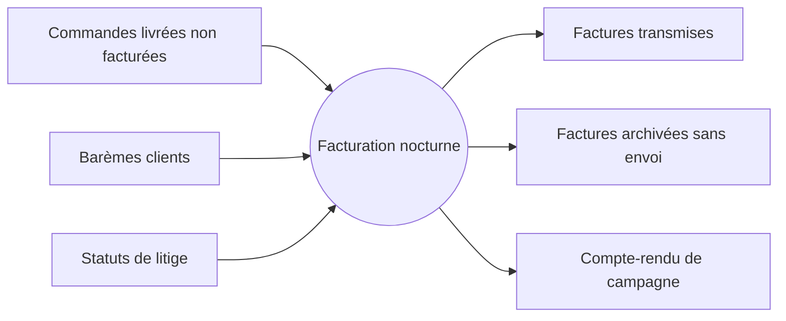

> **Question :** qu'entre-t-il et que sort-il de la facturation nocturne, vue de l'extérieur ?
> **Confiance : C — corroboré**

<!-- diagram: DIA-SFD-001 · N=7 E=6 McCabe=1 -->

# Liens

- section de : [DOC-SFD-FACT-001](../../../documents/doc-sfd-fact-001.md)
