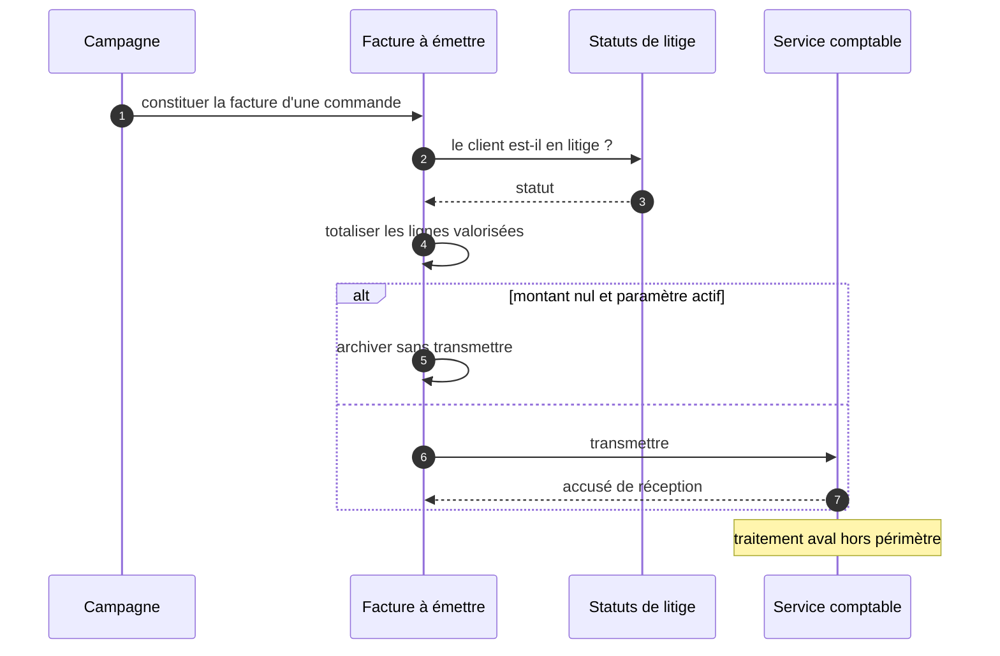

Ancré dans [`STD-facturation.md`](../../../documents/doc-std-fact-001.md) § 5 et § 9.

> **Question :** avec qui la constitution d'une facture dialogue-t-elle, et dans quel ordre ?
> **Confiance : C — corroboré** · une frontière non franchie en aval

<!-- diagram: DIA-SFD-003 · N=4 E=7 McCabe=3 -->

# Liens

- section de : [DOC-SFD-FACT-001](../../../documents/doc-sfd-fact-001.md)
