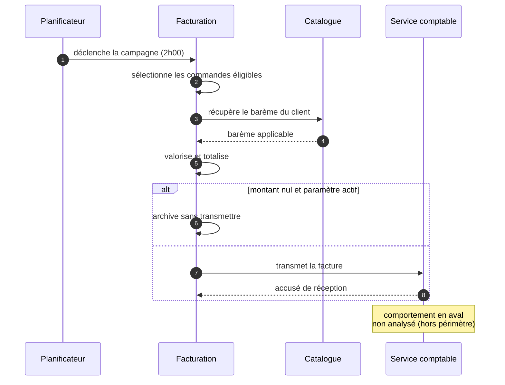

> **Documentation générée par DMAD** · run `atlas-2026-09-07-01` · 2026-09-07T15:40Z · commit `a1b2c3d`
> **Périmètre :** feature-scan « Facturation » — 22 % du code atteint, 90 % des zones à risque
> **Confiance globale : I** (minimum des chapitres) · 12 questions ouvertes
>
> ⚠️ Cette documentation est **reconstruite depuis le code**. Chaque affirmation porte
> son niveau de preuve : **V** vérifié · **C** corroboré · **I** inféré · **H** hypothèse
> à valider. Ne prenez pas une affirmation `I` ou `H` pour une décision métier établie.
>
> ⚠️ **Outillage partiellement dégradé :** couverture de tests disponible, mais aucune
> trace d'exécution. Les chemins décrits sont possibles, pas nécessairement empruntés.

---

# Facturation   [I · inféré · 34 affirmations · 5 à confirmer]

## En une phrase

Chaque nuit, le système sélectionne les commandes livrées et non encore facturées, calcule les montants dus, émet les factures correspondantes et les transmet au service comptable.

## Ce que fait le système

### Émettre les factures de la période   [C]

**Déclencheur** — automatique, toutes les nuits à 2 h
**Qui** — le système, sans intervention humaine

Le système retient les commandes livrées, non encore facturées, dont le client n'est pas en litige. Pour chacune, il valorise chaque ligne, applique le barème du client puis les remises éventuelles, et totalise. La facture ainsi constituée est datée du jour et transmise au service comptable.

**Cas particuliers**
- Le client est en litige → la commande est écartée de la campagne et reportée à la nuivante   [C]
- Le montant total est nul → **voir la règle correspondante ci-dessous**, dont le comportement dépend d'un paramètre   [I]
- La transmission au service comptable échoue → la facture est marquée en échec et retentée à la campagne suivante ; **elle n'est pas ré-émise**   [C]

### Refacturer manuellement une commande   [I]

**Déclencheur** — commande lancée par le support
**Qui** — un opérateur du support

Le support peut demander la réémission d'une facture pour une commande donnée. La facture est recalculée et transmise.

> ⚠️ **À confirmer :** ce chemin **n'applique pas les mêmes contrôles** que la facturation automatique. Voir `OQ-019`.

## Les règles appliquées

**Le montant de chaque ligne est calculé avec une précision de quatre décimales et arrondi au demi-supérieur. Les documents présentés au client et l'export comptable n'en affichent que deux.**   **[V — vérifié]**

> *Raisonnement supposé : la précision à quatre décimales daterait de la reprise des contrats au pourcentage en 2017, où l'arrondi à deux décimales provoquait des écarts cumulés sur les gros volumes.* **[H — à confirmer]**

---

**D'après l'analyse du code, lorsque le paramètre `billing.skipZeroAmount` est actif, une facture dont le montant est nul ne serait pas transmise au service comptable : elle serait archivée sans envoi. Lorsque le paramètre est inactif, elle serait transmise normalement.**   **[I — inféré]**

> ⚠️ Ce comportement **dépend d'un paramètre de configuration** : il est actif en production et en recette, mais inactif par défaut. Une facture à montant nul est donc traitée différemment selon l'environnement.

> ⚠️ Cette règle ne s'applique qu'à la facturation automatique. La refacturation manuelle contourne ce contrôle — voir `OQ-019`.

> *Raisonnement supposé : introduit pour éviter un rejet en masse par le service comptable lors de l'incident d'import de mars 2019. Une autre lecture est possible : il pourrait s'agir d'une règle comptable légitime (une facture à zéro n'étant pas émettable).* **[H — à confirmer, voir `OQ-012`]**

## Le parcours

> **Question :** que se passe-t-il, étape par étape, lors de la campagne de facturation nocturne ?
> **Confiance : C** · une frontière non franchie (comportement du service comptable en aval)

## Les données manipulées

Une **facture** porte un client, une date d'émission, un état et un montant total. Elle regroupe des **lignes de facture**, chacune rattachée à une ligne de commande, portant une quantité, un prix unitaire et un montant calculé.

Une facture passe par quatre états : *en préparation*, *transmise*, *archivée sans envoi*, *en échec*.

Chaque exécution nocturne constitue une **campagne de facturation**, qui conserve la date, le nombre de factures produites et le résultat.

## ⚠️ À confirmer par le métier

1. **Factures à montant nul** — Doivent-elles rester exclues de l'export comptable ? S'agit-il d'une règle comptable volontaire, ou du reliquat d'un incident technique de 2019 ?
   → *impact si on se trompe : élevé (conformité, ~340 factures/an)* · `BR-FACT-014` · `OQ-012`

2. **Refacturation manuelle** — Doit-elle appliquer les mêmes règles que la facturation automatique ? Aujourd'hui elle contourne le contrôle sur les montants nuls.
   → *impact : moyen à élevé selon la réponse à OQ-012* · `OQ-019`

3. **Précision à quatre décimales** — Choix métier lié aux contrats au pourcentage, ou héritage technique jamais questionné ?
   → *impact : moyen (écarts d'arrondi sur gros volumes)* · `BR-FACT-021` · `OQ-013`

4. **Clients en litige** — Le report à la campagne suivante est-il indéfini ? Aucune limite n'a été trouvée dans le code.
   → *impact : moyen (factures potentiellement jamais émises)* · `OQ-022`

5. **Échec de transmission** — Le nombre de tentatives semble illimité. Est-ce voulu ?
   → *impact : faible* · `OQ-023`

## Ce qui n'a pas été analysé

- **Le comportement du service comptable** en aval de la transmission (système externe, hors périmètre). Les règles décrites s'arrêtent à l'envoi.
- **Le module de relance**, rattaché à la capacité *Recouvrement*, documenté séparément.
- **Deux points d'appel dynamiques** dans le socle technique n'ont pas pu être résolus : ils masquent potentiellement des traitements supplémentaires (`OQ-017`).
