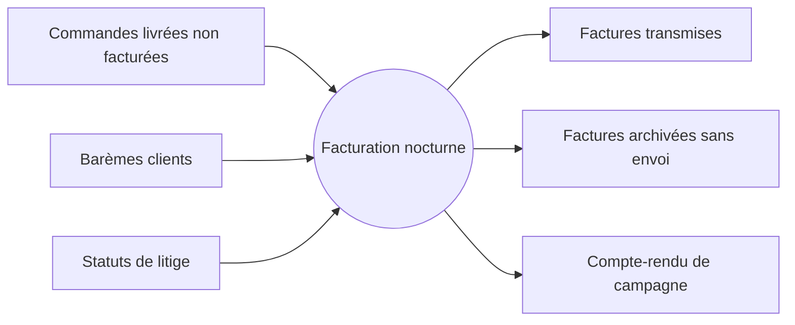
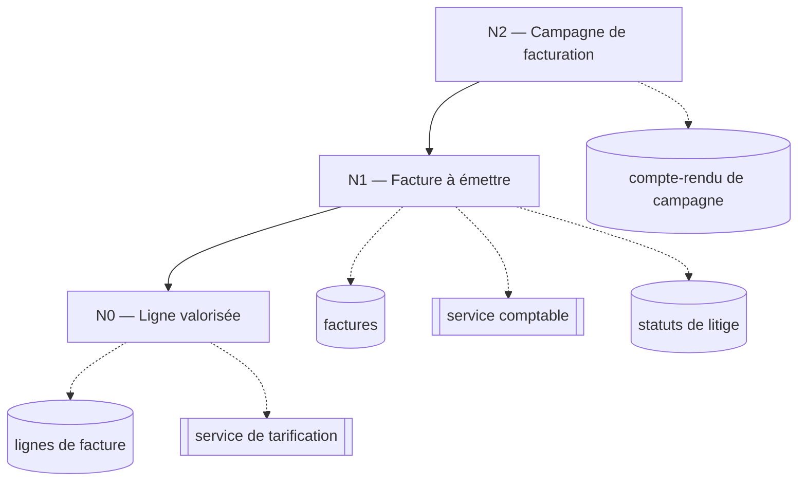
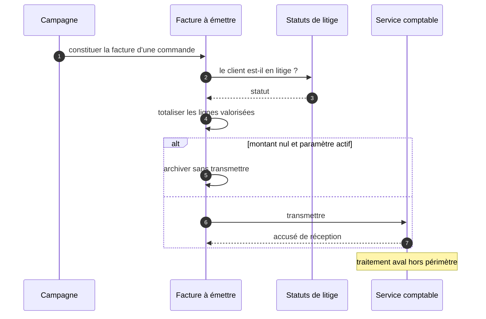

> **Documentation générée par DMAD** · run `atlas-2026-09-07-01` · commit `a1b2c3d`
> **Document :** SFD — arbre de business objects `Campagne de facturation`
> **Dérive de :** [`std/nightly-billing.md`](../std/nightly-billing.md) figée · **Alimente :** [`sfg/facturation.md`](../sfg/facturation.md)
> **Confiance globale : I** · 5 points à confirmer par le métier
>
> ⚠️ Chaque affirmation porte son niveau de preuve : **V** vérifié · **C** corroboré ·
> **I** inféré · **H** hypothèse à valider.

## Correspondance avec le reste du corpus

| Niveau | Couvert par la STD | Repris en SFG |
|---|---|---|
| N2 — Campagne de facturation | [`nightly-billing`](../std/nightly-billing.md) § 3, § 4 | CU-01 |
| N1 — Facture à émettre | [`nightly-billing`](../std/nightly-billing.md) § 5, § 9 | CU-01, CU-02 |
| N0 — Ligne valorisée | [`nightly-billing`](../std/nightly-billing.md) § 4, § 7 | CU-01 |

---

## 1. Principe et cadre

Ce document décrit **ce que le processus fait et avec quelles données**, en nominal et en erreur, ainsi que les sources et les puits qu'il mobilise. Il se lit par niveaux d'abstraction décroissants : le processus entier d'abord, ses composants ensuite.

Trois niveaux suffisent ici. Un quatrième aurait été un empilement inutile ; deux auraient produit un diagramme au-delà du seuil de lisibilité.

## 2. Le processus vu comme une seule opération

> **Question :** qu'entre-t-il et que sort-il de la facturation nocturne, vue de l'extérieur ?
> **Confiance : C**

## 3. Arbre de composition

> **Question :** comment le processus se décompose-t-il, et jusqu'où ?
> **Confiance : I** · regroupements proposés par l'analyse, validés au gate de découpage

## 4. N2 — Campagne de facturation

Ancré dans [`std/nightly-billing.md`](../std/nightly-billing.md) § 3 et § 4.

### Opérations de traitement
Constitution du compte-rendu de campagne : date, nombre de factures produites, résultat.

### Opérations de contrôle
Sélection des commandes éligibles — livrées, non facturées, client hors litige — puis itération sur chacune. Une facture en échec n'interrompt pas la campagne ; **un échec de tarification, si**.

### Données de traitement — initiales
Les commandes livrées et non facturées de la période.

### Données de traitement — ad-hoc
Aucune à ce niveau.

### Données de contrôle
L'heure de déclenchement, la taille de lot, le seuil de rejet au-delà duquel la campagne échoue.

### Sorties normales et anormales
**Normales** — un compte-rendu de campagne par exécution.
**Anormales** — au-delà de dix rejets, la campagne s'arrête et le compte-rendu porte l'échec.

## 5. N1 — Facture à émettre

Ancré dans [`std/nightly-billing.md`](../std/nightly-billing.md) § 5 et § 9.

> **Question :** avec qui la constitution d'une facture dialogue-t-elle, et dans quel ordre ?
> **Confiance : C** · une frontière non franchie en aval

### Opérations de traitement
Totalisation des lignes, datation, constitution de la facture.

### Opérations de contrôle
Deux gardes successives. La première écarte les clients en litige. La seconde, **conditionnée par un paramètre**, écarte les factures à montant nul.

### Données de traitement — initiales
La commande et ses lignes, transmises par le niveau supérieur.

### Données de traitement — ad-hoc
**Le statut de litige du client, lu une fois par commande — environ 1 400 lectures par campagne.** Aucune lecture par lot. C'est le premier candidat à l'optimisation si le temps de traitement devient un sujet.

### Données de contrôle
Le paramètre d'exclusion des montants nuls. **Il vaut vrai en production et en recette, faux par défaut dans le dépôt** : une facture à montant nul n'est donc pas traitée de la même façon selon l'environnement.

### Sorties normales et anormales
**Normales** — une facture transmise, ou une facture archivée sans envoi.
**Anormales** — un échec de transmission place la facture en échec ; elle est reprise à la campagne suivante, **cinq fois au maximum**.

> ⚠️ **Le site de levée et l'effet observable diffèrent.** Un échec de tarification est levé sur une seule ligne, mais interrompt la campagne entière. Le support observe l'arrêt du lot, pas la ligne fautive.

## 6. N0 — Ligne valorisée

Ancré dans [`std/nightly-billing.md`](../std/nightly-billing.md) § 4 et § 7.

### Opérations de traitement
Valorisation d'une ligne : quantité multipliée par le prix unitaire du barème, **avec une précision de quatre décimales et un arrondi au demi-supérieur**. **[V — vérifié]**

### Opérations de contrôle
Aucune. C'est un objet atomique : il n'invoque que des feuilles externes.

### Données de traitement — initiales
La ligne de commande : quantité, référence produit.

### Données de traitement — ad-hoc
**Le barème du client, demandé au service de tarification une fois par ligne — jusqu'à quarante appels par facture.** Le contrat de ce service n'a pas pu être établi (voir `OQ-024`), et son comportement en cas d'indisponibilité interrompt la campagne.

### Données de contrôle
Aucune.

### Sorties normales et anormales
**Normales** — une ligne de facture portant un montant à quatre décimales.
**Anormales** — l'indisponibilité du service de tarification interrompt le traitement sans notification.

## 7. Synthèse

| Business object | Feuilles propres | Sous-objets | Profondeur | Couche métier |
|---|---|---|---|---|
| Campagne de facturation | compte-rendu de campagne | Facture à émettre | 2 | orchestration |
| Facture à émettre | factures · service comptable · statuts de litige *(ad-hoc, en boucle)* | Ligne valorisée | 1 | préparation |
| Ligne valorisée | lignes de facture · service de tarification *(ad-hoc, en boucle)* | — | 0 | calcul |

## À confirmer par le métier

1. **Factures à montant nul** — règle comptable voulue, ou reliquat de l'incident d'import de 2019 ? → `BR-FACT-014` · `OQ-012`
2. **Refacturation manuelle** — doit-elle appliquer les mêmes règles ? Elle contourne aujourd'hui la garde. → `OQ-019`
3. **Précision à quatre décimales** — choix métier lié aux contrats au pourcentage, ou héritage ? → `BR-FACT-021` · `OQ-013`
4. **Clients en litige** — le report est-il indéfini ? Aucune limite trouvée. → `OQ-022`
5. **Service de tarification** — quel contrat, quelle supervision ? → `OQ-024`

## Ce qui n'a pas été analysé

- Le traitement en aval du service comptable, hors périmètre.
- Le module de relance, rattaché à la capacité *Recouvrement*.
- Deux points d'appel dynamiques du socle technique, non résolus — ils masquent potentiellement des traitements supplémentaires (`OQ-017`).
