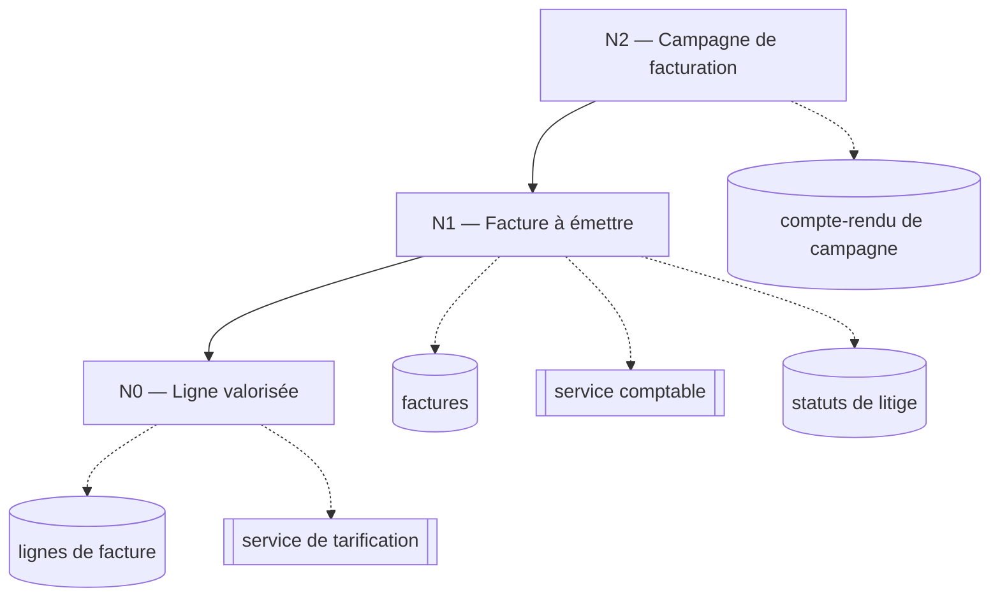

> **Question :** comment le processus se décompose-t-il, et jusqu'où ?
> **Confiance : I — inféré** · regroupements proposés par l'analyse, validés au gate de découpage

<!-- diagram: DIA-SFD-002 · N=9 E=8 McCabe=1 -->

# Liens

- relève de : [facturation](../../../socle/capacites/facturation.md)
