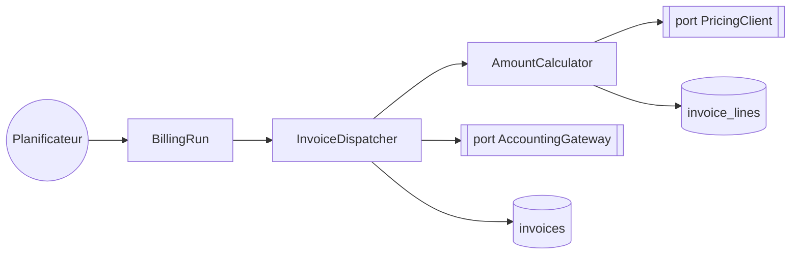

Le batch est câblé en trois couches : un déclencheur planifié, un service d'orchestration, et deux ports sortants.

> **Question :** quels composants ce batch mobilise-t-il, et lesquels franchissent une frontière ?
> **Confiance : C — corroboré** · deux dispatchs non résolus, cf. § 7

<!-- diagram: DIA-STD-001 · N=8 E=7 McCabe=1 -->

`BillingRun` orchestre, `InvoiceDispatcher` décide et transmet, `AmountCalculator` valorise. Les deux ports sont les seules sorties du périmètre.

# Liens

- relève de : [facturation](../../../socle/capacites/facturation.md)
