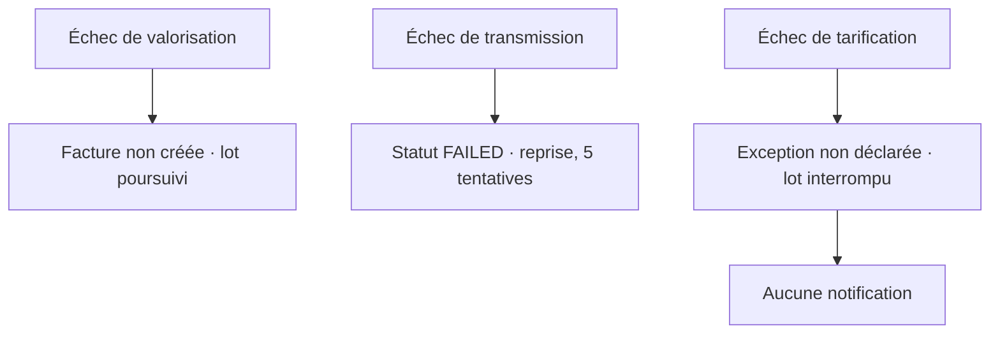

> **Question :** que devient une facture selon l'endroit où l'exécution échoue, et que le support observe-t-il ?
> **Confiance : C — corroboré** · aucune trace d'exécution pour confirmer les fréquences

<!-- diagram: DIA-STD-003 · N=7 E=4 McCabe=1 -->

**Site de levée et effet observable sont distincts, et il faut les lire séparément.** Un échec de tarification est levé sur **une ligne** ; son effet observable est l'interruption de **tout le lot**, parce que l'exception n'est pas déclarée et remonte jusqu'au gestionnaire de campagne. Les confondre produirait deux affirmations contradictoires dans la SFD.

Exceptions **non déclarées** : `PricingUnavailableException` remonte sans être capturée — c'est le chemin qui interrompt le lot.
**Chemin inatteignable** : la branche `skipZeroAmount = false` n'est couverte par aucun test.

# Liens

- relève de : [facturation](../../../socle/capacites/facturation.md)
