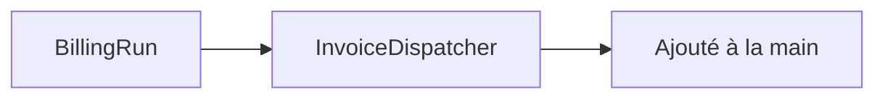

<!-- Violation R3 : le diagramme a été retouché après rendu. Il peut désormais
     contredire le graphe dont il est censé sortir. -->

## 1. Cartographie des composants

Aucun objet dans ce chemin. Périmètre : le seul point d'entrée documenté.

> **Question :** quels composants ce batch mobilise-t-il ?
> **Confiance : C — corroboré**

<!-- diagram: DIA-DRIFT-001 · N=2 E=1 McCabe=1 -->

## 2. Modèle de données

Aucun objet dans ce chemin. Périmètre : le seul point d'entrée documenté.

## 3. Traitement de données

Aucun objet dans ce chemin. Périmètre : le seul point d'entrée documenté.

## 4. Gestion des erreurs

Aucun objet dans ce chemin. Périmètre : le seul point d'entrée documenté.

## 5. Appels externes

Aucun objet dans ce chemin. Périmètre : le seul point d'entrée documenté.

## 6. Dépendances

Aucun objet dans ce chemin. Périmètre : le seul point d'entrée documenté.

## 7. Points d'attention pour le développeur

Aucun objet dans ce chemin. Périmètre : le seul point d'entrée documenté.

## 8. Cas de test

Aucun objet dans ce chemin. Périmètre : le seul point d'entrée documenté.

## 9. Références

Aucun objet dans ce chemin. Périmètre : le seul point d'entrée documenté.

## 10. Historique

Aucun objet dans ce chemin. Périmètre : le seul point d'entrée documenté.

## 11. Annexes

Aucun objet dans ce chemin. Périmètre : le seul point d'entrée documenté.
