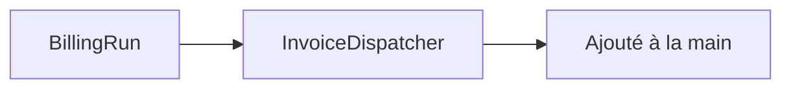

<!-- Violation R3 : le diagramme a été retouché après rendu. Il peut désormais
     contredire le graphe dont il est censé sortir. -->

## 1. Cartographie des composants

Aucun objet dans ce chemin. Périmètre : le seul point d'entrée documenté.

> **Question :** quels composants ce batch mobilise-t-il ?
> **Confiance : C — corroboré**

<!-- diagram: DIA-DRIFT-001 · N=2 E=1 McCabe=1 -->

## 2. Configuration

Aucun objet dans ce chemin. Périmètre : le seul point d'entrée documenté.

## 3. Architecture du flux

Aucun objet dans ce chemin. Périmètre : le seul point d'entrée documenté.

## 4. Détail par étape

Aucun objet dans ce chemin. Périmètre : le seul point d'entrée documenté.

## 5. Traitement unitaire

Aucun objet dans ce chemin. Périmètre : le seul point d'entrée documenté.

## 6. Séquence technique

Aucun objet dans ce chemin. Périmètre : le seul point d'entrée documenté.

## 7. Modèle de données

Aucun objet dans ce chemin. Périmètre : le seul point d'entrée documenté.

## 8. Requêtes clés

Aucun objet dans ce chemin. Périmètre : le seul point d'entrée documenté.

## 9. Appels externes

Aucun objet dans ce chemin. Périmètre : le seul point d'entrée documenté.

## 10. Événements

Aucun objet dans ce chemin. Périmètre : le seul point d'entrée documenté.

## 11. Mapping et transformations

Aucun objet dans ce chemin. Périmètre : le seul point d'entrée documenté.

## 12. Gestion des erreurs

Aucun objet dans ce chemin. Périmètre : le seul point d'entrée documenté.

## 13. Dépendances

Aucun objet dans ce chemin. Périmètre : le seul point d'entrée documenté.

## 14. Points d'attention

Aucun objet dans ce chemin. Périmètre : le seul point d'entrée documenté.

## 15. Cas de test

Aucun objet dans ce chemin. Périmètre : le seul point d'entrée documenté.

## 16. Références croisées

Aucun objet dans ce chemin. Périmètre : le seul point d'entrée documenté.

## 17. Historique

Aucun objet dans ce chemin. Périmètre : le seul point d'entrée documenté.
