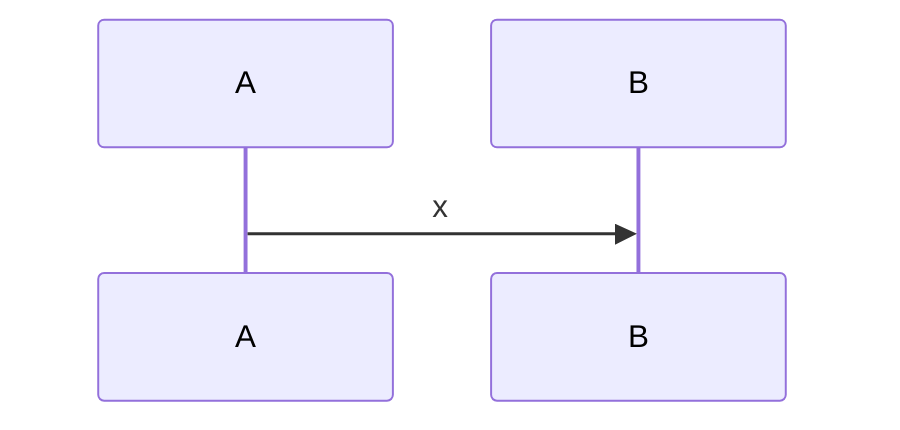

<!-- Violation R3 : un diagramme écrit à la main, sans rendu depuis le graphe. -->

## 1. Cartographie des composants

Aucun objet dans ce chemin. Périmètre : le seul point d'entrée documenté.

> **Question :** qui appelle quoi ?
> **Confiance : C — corroboré**

## 2. Modèle de données

Aucun objet dans ce chemin. Périmètre : le seul point d'entrée documenté.

## 3. Traitement de données

Aucun objet dans ce chemin. Périmètre : le seul point d'entrée documenté.

## 4. Gestion des erreurs

Aucun objet dans ce chemin. Périmètre : le seul point d'entrée documenté.

## 5. Appels externes

Aucun objet dans ce chemin. Périmètre : le seul point d'entrée documenté.

## 6. Dépendances

Aucun objet dans ce chemin. Périmètre : le seul point d'entrée documenté.

## 7. Points d'attention pour le développeur

Aucun objet dans ce chemin. Périmètre : le seul point d'entrée documenté.

## 8. Cas de test

Aucun objet dans ce chemin. Périmètre : le seul point d'entrée documenté.

## 9. Références

Aucun objet dans ce chemin. Périmètre : le seul point d'entrée documenté.

## 10. Historique

Aucun objet dans ce chemin. Périmètre : le seul point d'entrée documenté.

## 11. Annexes

Ce chapitre porte **1 légende** de notation, pour le **1 diagramme** du document.

### 11.1 Légende — diagramme de séquence

Le temps descend ; une flèche pleine est un appel, une pointillée une réponse.
