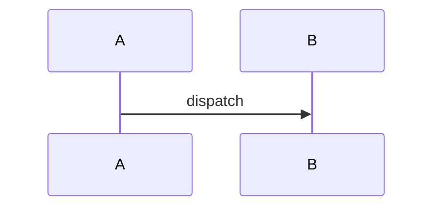

<!-- Violation : une notation employée sans sa légende. Le lecteur interprète le dessin. -->

## 1. Cartographie des composants

Aucun objet dans ce chemin. Périmètre : le seul point d'entrée documenté.

## 2. Modèle de données

Aucun objet dans ce chemin. Périmètre : le seul point d'entrée documenté.

## 3. Traitement de données

> **Question :** qui appelle quoi ?
> **Confiance : C — corroboré**

<!-- diagram: DIA-FIX-001 · N=2 E=1 McCabe=1 -->

## 4. Gestion des erreurs

Aucun objet dans ce chemin. Périmètre : le seul point d'entrée documenté.

## 5. Appels externes

Aucun objet dans ce chemin. Périmètre : le seul point d'entrée documenté.

## 6. Dépendances

Aucun objet dans ce chemin. Périmètre : le seul point d'entrée documenté.

## 7. Points d'attention pour le développeur

Aucun objet dans ce chemin. Périmètre : le seul point d'entrée documenté.

## 8. Cas de test

Aucun objet dans ce chemin. Périmètre : le seul point d'entrée documenté.

## 9. Références

Aucun objet dans ce chemin. Périmètre : le seul point d'entrée documenté.

## 10. Historique

Aucun objet dans ce chemin. Périmètre : le seul point d'entrée documenté.

## 11. Annexes

Ce chapitre porte les limites de l'analyse.

### 11.1 Limites de cette analyse

Profondeur de traversée : 5.
